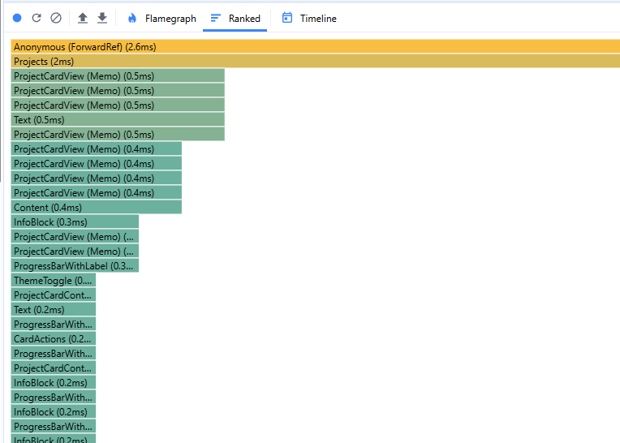
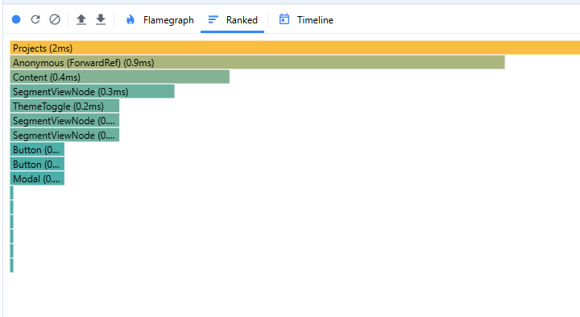

# CENFOTEC React Avanzado - Raúl Arias Quesada

## Proyecto React con Next.js

## Observaciones entrega tarea 3.

- Para el punto A.1 se carga una imagen en el layout.
- Para el punto A.2 se carga fuentes en el layout.
- Para el punto A.3 se cargan metadatos en el page home.
- Para el punto A.4 se tienen loadings en las tareas y proyectos, y se tiene un timer para que dure más la animación.
- Para el punto B.1 se usa react memo en: KanbanTask y ProjectCardView para optimizar el renderizado de las listas más grandes y visuales del app
- Para el punto B.2 se usa el useMemo en el hook useFilters para optimizar el rendimiento y evitar que los filtros se recalculen en cada render sino que se haga solo cuando cambie la lista de tareas o los filtros.
- Para el punto B.3 se usa el useCallback en los hooks useForm y useLocalStorage para evitar que los componentes hijos que reciben estas funciones como props se vuelvan a renderizar innecesariamente.

## Evidencia de optimización

- En la pantalla de listado de proyectos, sin el React.Memo al presionar el botón de Agregar proyecto se renderizan todos los proyectos sin que estos hayan sufrido cambios, lo mismo al presionar el botón de cerrar el modal sin agregar proyectos se renderiza de nuevo toda la lista.
  

- Al aplicar React.Memo se deja de renderizar la lista cuando se presiona este botón y cuando se cierra el modal.
  
