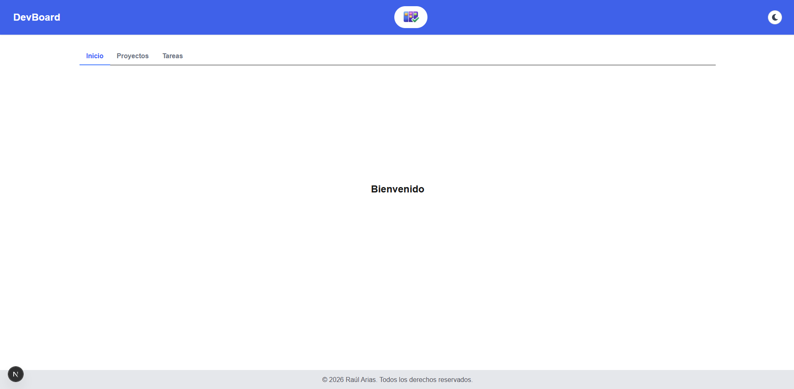
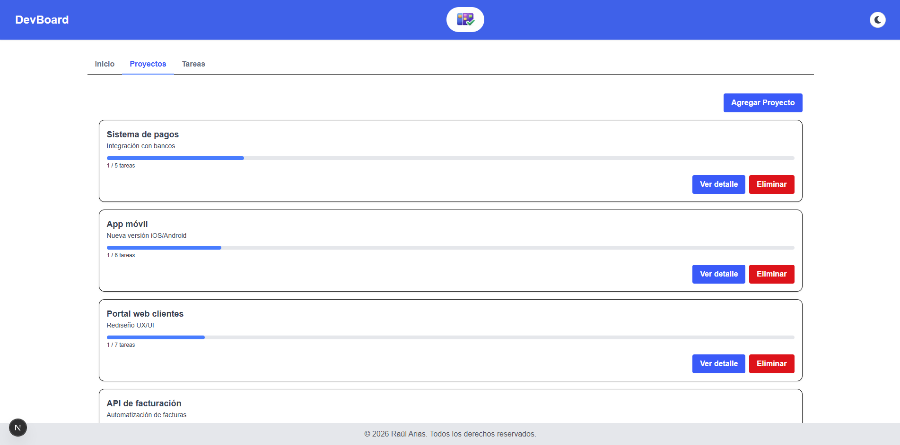
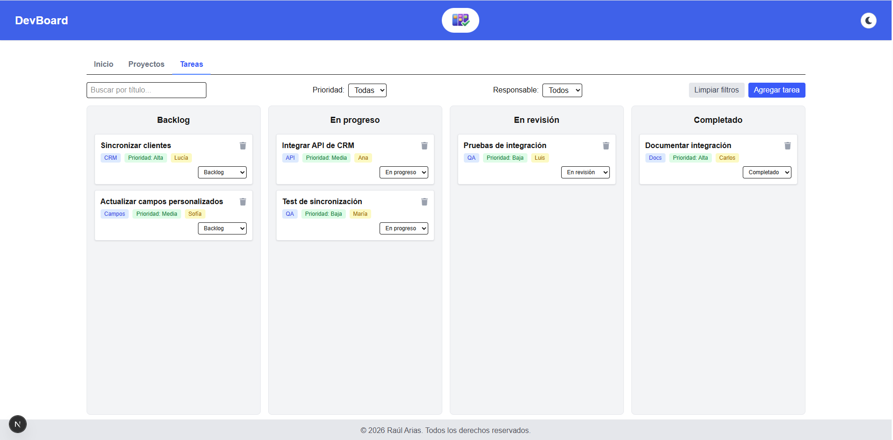

# CENFOTEC React Avanzado - Raúl Arias Quesada

## Proyecto React con Next.js

## Instrucciones instalación y ejecución

- Ejecutar el comando: npm install para la instalación de paquetes.
- Ejecutar el comando: npm run dev para la ejecución local.
- Disponible localmente en http://localhost:3000.

## Observaciones entrega tarea 1.

- Para el punto 4, se implementa el ProjectCardContainer y ProjectCardView.
- Para el punto 6 se implementa el Tabs.
- Para el Bonus se implementa el Modal y el variant en el Button.

## Observaciones entrega tarea 2.

- Para el punto A.3, se implementa el loading en projects.
- Para el punto B.1 se crean los hooks useForm y useLocalStorage.
- Para el punto B.2 se crea el reducer en el hook useTasks.
- Para el punto B.3 se usa el estado derivado en el componente ProjectCardContainer.
- Para el punto B.5 se crea el Context ThemeContext con su respectivo hook useTheme.
- Para el punto B.6 se usa el AppProviders en el ClientThemeLayout

## Observaciones entrega tarea 3.

- Ver el archivo OPTIMIZATIONS.md

## Vista final del proyecto

